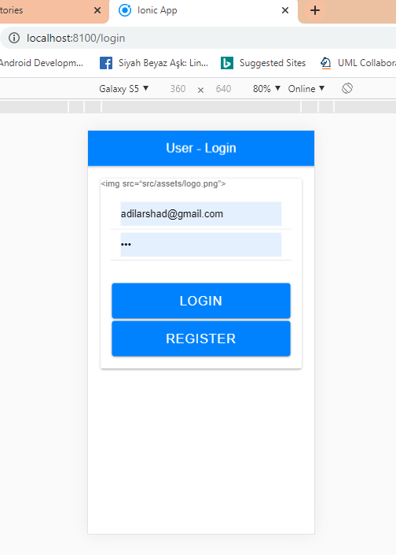
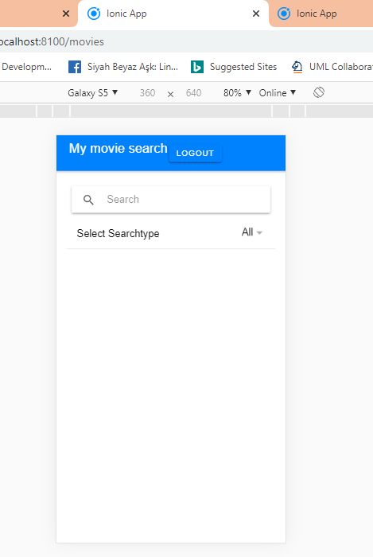
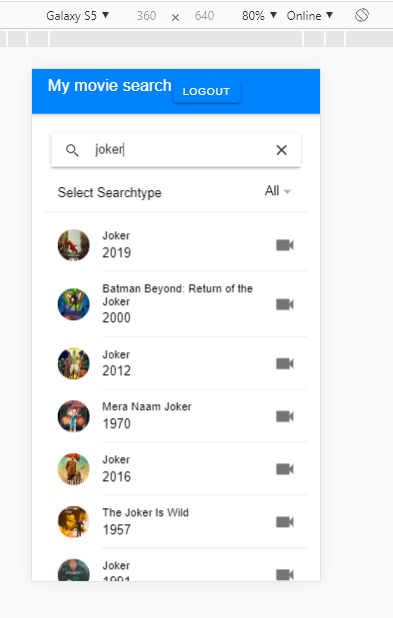
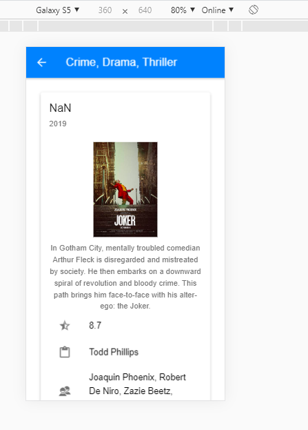

### This is my MAD project named Artist Express. This application allow user to search for an artist and user can view all details of artist.
### I have used one API and tried to use second one but could not do it due to shortage of time.
### I have deployed server online but i am getting tail error and unfortunately I could not solve that either due to shortage of time.
### Rest all tast on GitHub are followed.
### Crud operations are being performed.

